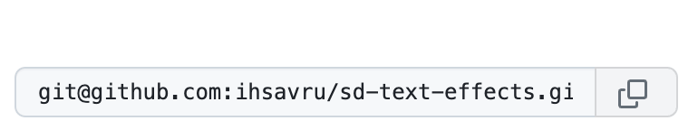
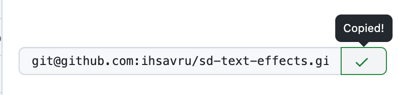

# Description

1. Create an input element.
2. Create a button next to it with the copy icon.
3. When the button is clicked, the value of the text input should be copied to your clickboard and a tooltip should appear on top of the button that says "Copied!".
